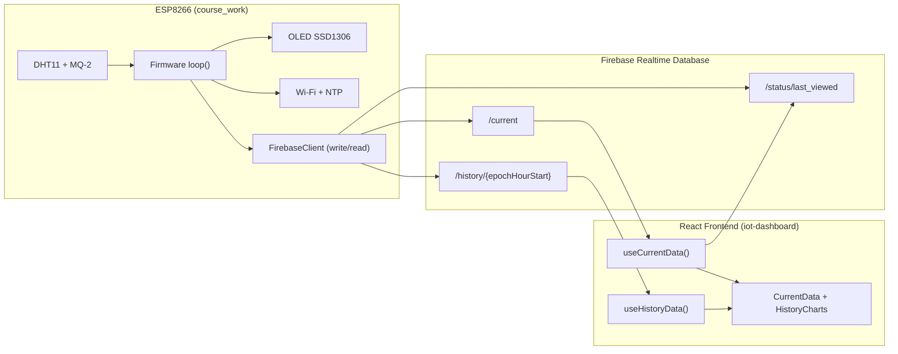
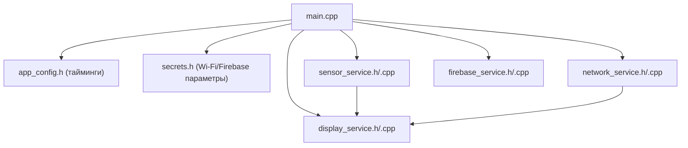
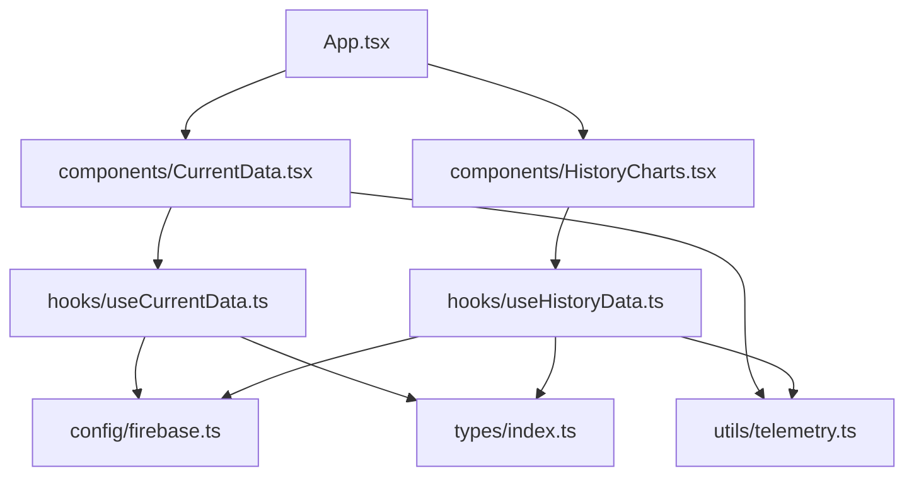
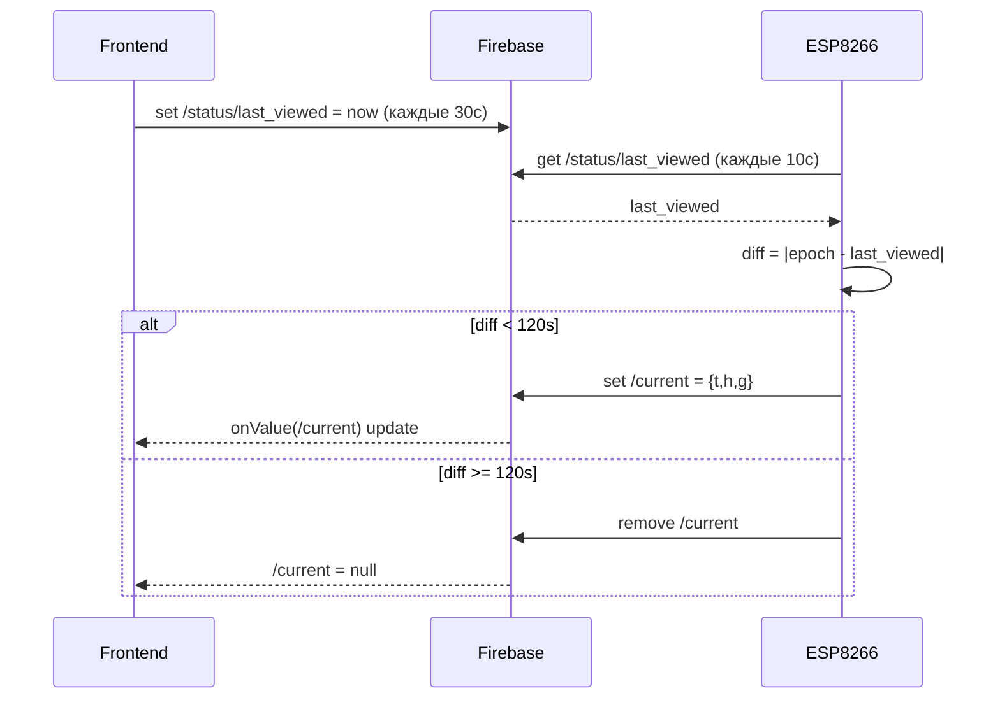
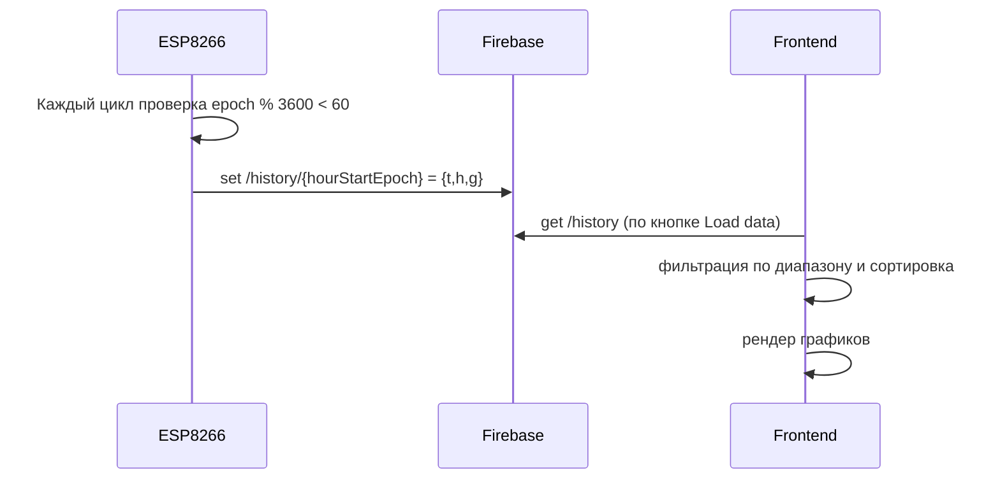
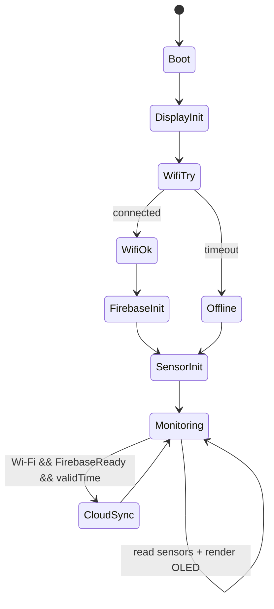

# Полная техническая документация проекта IoT (ESP8266 + Firebase + React)

## 1. Назначение системы

Проект реализует полный IoT-контур:

1. **Микроконтроллер (ESP8266 / NodeMCU v2)** собирает телеметрию с датчиков (температура, влажность, газ), показывает её на OLED и отправляет в Firebase Realtime Database.
2. **Frontend (React + TypeScript)** читает данные из Firebase:
   - `current` — «живые» текущие показания;
   - `history` — почасовая история.
3. Frontend отправляет heartbeat (`/status/last_viewed`), по которому прошивка понимает, активен ли пользователь, и решает, публиковать ли `current`.

---

## 2. Состав репозитория

- `course_work/` — прошивка микроконтроллера (PlatformIO, Arduino framework).
- `iot-dashboard/` — веб-панель мониторинга (Vite + React + TypeScript + MUI + Recharts + Firebase SDK).
- `generate/` — вспомогательные скрипты генерации данных (не участвуют в основном runtime-контуре прошивка↔frontend).

---

## 3. Архитектура на уровне подсистем



---

## 4. Прошивка микроконтроллера (`course_work`)

## 4.1 Платформа и зависимости

Файл: `course_work/platformio.ini`

- Плата: `nodemcuv2`
- Фреймворк: `arduino`
- Основные библиотеки:
  - `Adafruit SSD1306`, `Adafruit GFX` — OLED UI;
  - `DHT sensor library` — DHT11;
  - `MQUnifiedsensor` — MQ-2;
  - `NTPClient` — сетевое время;
  - `FirebaseClient` (mobizt) — асинхронная работа с RTDB.

## 4.2 Модульная структура прошивки



## 4.3 Константы и интервалы (app_config)

- `WIFI_TIMEOUT_MS = 15000` — максимум ожидания подключения к Wi-Fi при старте.
- `SENSOR_UPDATE_INTERVAL_MS = 1000` — период основного цикла измерений/экрана.
- `ACTIVITY_INTERVAL_MS = 10000` — период проверки пользовательской активности (через `/status/last_viewed`).
- `MIN_VALID_EPOCH = 1700000000` — нижняя граница «валидного» NTP времени.

## 4.4 Инициализация (`setup()`)

Порядок выполнения:

1. `Serial.begin(115200)`.
2. `beginDisplay()`:
   - при неуспехе — бесконечный цикл (жёсткий fail-stop).
3. `connectWiFiAndTime(SSID, PASSWORD, WIFI_TIMEOUT_MS)`:
   - успешное подключение к Wi-Fi;
   - запуск NTP (`pool.ntp.org`, offset `0`, то есть UTC);
   - первичное обновление времени.
4. Если Wi-Fi подключён: `beginFirebase(FIREBASE_HOST)`.
5. `beginSensors()`:
   - `dht.begin()`;
   - калибровка MQ-2 (10 итераций, усреднение `R0`).
6. На OLED выводится `Init complete / Monitoring...`.

## 4.5 Основной цикл (`loop()`)

### Выполняется непрерывно

- `loopFirebase()` вызывается всегда, чтобы обрабатывать асинхронные результаты Firebase.

### Раз в 1 секунду (`SENSOR_UPDATE_INTERVAL_MS`)

1. `updateNetworkTime()`.
2. Чтение датчиков: `readSensors()`:
   - `temperature = dht.readTemperature()`;
   - `humidity = dht.readHumidity()`;
   - `gas = mq2.readSensor()`.
3. Получение времени:
   - `epoch = getNetworkEpoch()`;
   - `formattedTime = getNetworkFormattedTime()`;
   - `timeValid = isNetworkTimeValid(epoch, MIN_VALID_EPOCH)`.
4. Отрисовка OLED: `renderTelemetry(...)`.
5. Если одновременно:
   - Wi-Fi подключён;
   - Firebase готов (`isFirebaseReady()`);
   - время валидно;
   
   тогда:

   1. Раз в 10 секунд запрашивается пользовательская активность:
      `checkActivityAndSyncCurrent(...)` → `database.get("/status/last_viewed")`.
   2. Раз в час (в окне первых 60 секунд часа) пишется история:
      - вычисляется `hourStartEpoch = epoch - (epoch % 3600)`;
      - запись в `/history/{hourStartEpoch}`.

## 4.6 Логика активности пользователя (`/current`)

Ключевая идея: **ветка `/current` существует только когда пользователь «недавно смотрел дашборд»**.

Алгоритм:

1. Прошивка сохраняет pending-значения телеметрии и делает `get("/status/last_viewed")`.
2. В `loopFirebase()` после получения ответа вычисляется `diff = |pendingEpoch - last_viewed|`.
3. Если `diff < 120 секунд`:
   - пишется `/current = {"t":..., "h":..., "g":...}`.
4. Иначе:
   - `/current` удаляется (`database.remove("/current")`).

Это снижает лишний трафик «живых» данных, когда пользователь не открыт в UI.

## 4.7 Логика записи истории (`/history`)

- Частота: **1 запись в час**.
- Защита от дубликатов: `lastHistoryHourSent`.
- Формат пути: `/history/<epoch начала часа UTC>`.
- Payload включает те же метрики: `t, h, g`.

## 4.8 Защита от невалидных датчиков

Перед отправкой:

- `temperature/humidity` проходят `sanitizeReading()`:
  - если `NaN`, заменяются на `0.0`.
- Газ отправляется как есть (далее frontend округляет до ppm).

На OLED:

- Если `NaN` у температуры/влажности, на экране показывается `0`.

## 4.9 Отображение на OLED (`display_service`)

- Разрешение: `128x32`.
- В обычном режиме:
  - строка даты/времени (если время валидно);
  - `Tmp`, `Hum`, `Gas`.
- Если время невалидно:
  - показывается `Time: Syncing...`.

---

## 5. Облачный слой (Firebase Realtime Database)

## 5.1 Структура данных

```json
{
  "current": { "t": 23.5, "h": 62.1, "g": 3200 },
  "history": {
    "1712700000": { "t": 22.1, "h": 64.2, "g": 2800 },
    "1712703600": { "t": 22.5, "h": 63.8, "g": 2900 }
  },
  "status": {
    "last_viewed": 1712703650
  }
}
```

> В коде фронтенда предусмотрен парсинг и объекта, и JSON-строки, поэтому система толерантна к обеим формам хранения payload.

## 5.2 Контракт данных

- `t`: температура, `number`, °C.
- `h`: влажность, `number`, %.
- `g`: газ, `number` (сырое значение датчика, в UI приводится к `ppm` округлением).
- Все timestamp — **Unix epoch, секунды, UTC**.

---

## 6. Frontend (`iot-dashboard`)

## 6.1 Стек

- React 19 + TypeScript
- Vite
- Material UI
- Recharts
- Firebase JS SDK (Realtime Database)

## 6.2 Структура модулей



## 6.3 Поток «живых» данных (`useCurrentData`)

1. Создаётся подписка `onValue(ref(database, "current"))`.
2. На каждом обновлении:
   - payload проходит `parseTelemetryPayload`;
   - при успехе обновляется state `data`, `lastUpdated`;
   - при ошибке — state `error`.
3. Параллельно heartbeat:
   - сразу при монтировании;
   - далее каждые `30 сек`;
   - в `/status/last_viewed` пишется текущее UTC-время клиента.

Эта запись — триггер для прошивки, чтобы она не удаляла `/current`.

## 6.4 Поток исторических данных (`useHistoryData`)

1. По кнопке `Load data` компонент применяет диапазон дат.
2. Хук делает `get(ref(database, "history"))`.
3. Клиент фильтрует записи по диапазону `startTimestamp..endTimestamp`.
4. Каждая запись:
   - парсится;
   - преобразуется в `ChartDataPoint`;
   - сортируется по `timestamp`.
5. `HistoryCharts` строит график в выбранном режиме:
   - все метрики;
   - только температура;
   - только влажность;
   - только газ.

## 6.5 UI-уровень

- `CurrentData`:
  - 3 карточки (temperature/humidity/gas);
  - индикатор Live;
  - время последнего обновления.
- `HistoryCharts`:
  - выбор дат;
  - валидация диапазона;
  - интерактивный график.

---

## 7. Сквозные сценарии взаимодействия

## 7.1 Публикация текущих данных при активном пользователе



## 7.2 Почасовая запись истории



---

## 8. Машина состояний прошивки (упрощённо)



---

## 9. Важные инженерные особенности

1. **UTC везде**: NTP offset = `0`, timestamp — epoch в секундах.
2. **Async Firebase в прошивке**: операции не блокируют основной цикл.
3. **Экономия realtime-трафика**: `/current` живёт только при heartbeat от frontend.
4. **История не потоковая, а батчевая**: frontend запрашивает `history` по требованию.
5. **Fail-fast экран**: без OLED запуск останавливается (по текущей реализации).

---

## 10. Ограничения текущей реализации

1. **Секреты находятся в `secrets.h`** (Wi-Fi/Firebase значения хранятся в коде).
2. История на фронтенде загружается целиком, а затем фильтруется локально (при росте объёма может быть тяжело).
3. Нет аутентификации устройства в Firebase (`NoAuth` в прошивке).
4. При ошибке дисплея устройство зависает в бесконечном цикле.

---

## 11. Рекомендации по развитию

1. Вынести секреты в приватный конфиг/секрет-хранилище и исключить из репозитория.
2. Перейти на выборочные запросы истории (индексация + диапазонные запросы RTDB/перенос в Firestore/Timeseries backend).
3. Добавить auth для устройства (custom token/service account flow на безопасном backend).
4. Добавить буферизацию оффлайн-данных (store-and-forward при потере Wi-Fi).
5. Добавить health-метрики прошивки (uptime, RSSI, last publish status).

---

## 12. Карта соответствия «папка → ответственность»

| Путь | Ответственность |
|---|---|
| `course_work/src/main.cpp` | orchestration boot + runtime loop |
| `course_work/src/sensor_service.cpp` | чтение DHT11 и MQ-2, калибровка MQ-2 |
| `course_work/src/network_service.cpp` | Wi-Fi + NTP + валидация времени |
| `course_work/src/firebase_service.cpp` | async read/write Firebase, activity logic |
| `course_work/src/display_service.cpp` | визуализация статусов и телеметрии на OLED |
| `iot-dashboard/src/hooks/useCurrentData.ts` | realtime-подписка на `current` + heartbeat |
| `iot-dashboard/src/hooks/useHistoryData.ts` | загрузка и фильтрация `history` |
| `iot-dashboard/src/components/CurrentData.tsx` | карточки текущих показаний |
| `iot-dashboard/src/components/HistoryCharts.tsx` | графики истории и фильтры диапазона |
| `iot-dashboard/src/utils/telemetry.ts` | парсинг payload и нормализация газа |

---

## 13. Краткий итог логики взаимодействия MCU ↔ Frontend

- **MCU** — источник данных и писатель в Firebase.
- **Frontend** — читатель и индикатор пользовательской активности.
- **Firebase** — транспорт и хранилище.
- Ветка `current` управляется активностью пользователя через `status/last_viewed`.
- Ветка `history` формируется микроконтроллером почасово и читается фронтендом по запросу.

